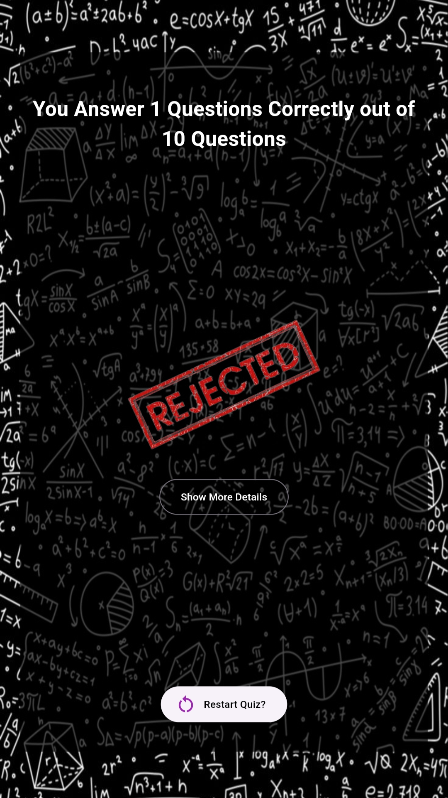
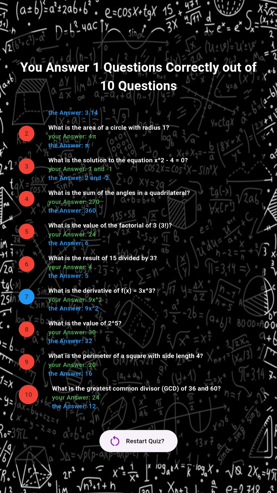

# Math Quiz App
is built using Flutter. It allows users to test their math skills by answering 10 randomly arranged math questions. At the end of the quiz, users can view their results and see detailed feedback on their answers.

## App Structure
- **Main**:
  - Entry point of the application.
- **Quiz**:
  - The Tree Widget to Navige in the whole app
- **WelcomeScreen**:
  - The starting screen of the app, featuring a button to begin the quiz.
  - 
- **Questions**:
  - Displays 10 math questions with answers arranged randomly each time.
  - 
- **Results**:
  - Shows the number of correct answers compared to the total questions, with an image indicating pass or fail.
  - 
  - Features a button to preview more detailed results, including:
    - Question index with a color indicator for correct/incorrect answers
    - The question itself
    - The correct answer
    - The user's answer
  - Includes a restart button to begin the quiz again.
  - 
